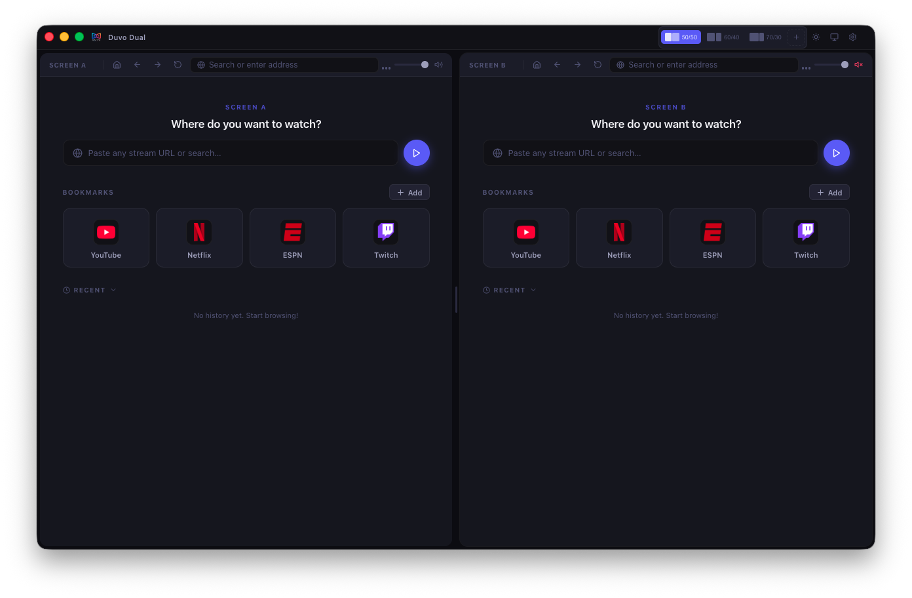
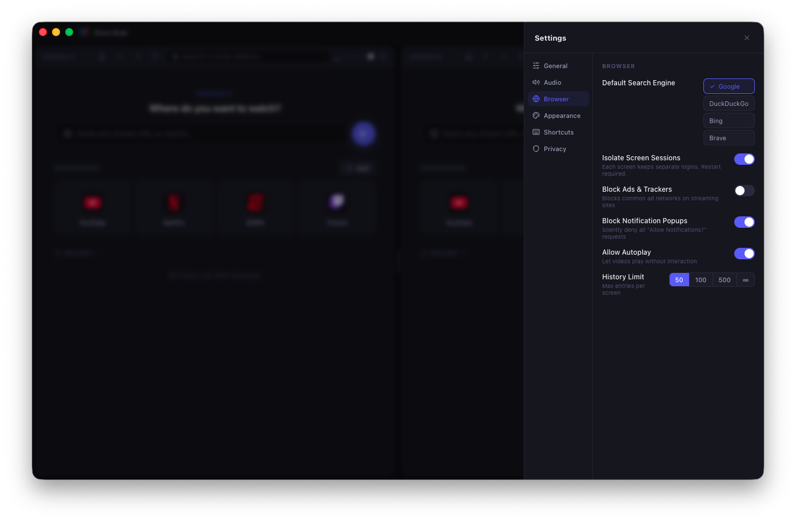

# Duvo Dual

**A premium dual-screen streaming browser for macOS & Windows — by [MavTiN](https://github.com/mavtin)**

Watch two streams simultaneously — YouTube, Twitch, Netflix, ESPN, or any website — side by side in a single window. No extensions. No hacks. Built from scratch.

---

## Screenshots


*Home screen — quick-access bookmarks for YouTube, Netflix, ESPN, Twitch and any site you add*


*Watch two live streams at the same time — football, sports, news, anything side by side*


*Full settings panel — search engine, session isolation, ad blocking, notifications, shortcuts and more*

---

## Features

- **Dual panel browser** — Two fully independent browser panels, side by side
- **Ad Blocker** — EasyList + EasyPrivacy, 100,000+ blocked domains, zero config
- **Independent audio routing** — Per-panel volume, mute, and stereo pan controls
- **Session isolation** — Each panel has its own cookies and login sessions
- **Custom layout presets** — Save named split ratios (70/30, custom, etc.)
- **Auto-hide toolbar** — Clean, immersive viewing mode
- **Notification blocker** — Silently blocks all "Allow Notifications?" requests
- **Multi-monitor mode** — Send each panel to a separate display
- **Custom keyboard shortcuts** — Remap all hotkeys
- **Bookmark manager** — Drag-to-reorder bookmarks per panel
- **Dark / Light / System theme** with accent color picker
- **Fullscreen support** — Per-panel fullscreen with proper shim for SPAs

---

## Download

Grab the latest installer from the [**Releases**](https://github.com/mavtin/Duvo-Dual/releases) page.

| Platform | File |
|---|---|
| **macOS** (Apple Silicon + Intel) | `.dmg` |
| **Windows** (64-bit) | `.exe` (NSIS installer) |

> **macOS Gatekeeper note:** Since this app is not yet notarized, you may see a security warning on first launch. Right-click the app → **Open** to bypass it.

---

## Tech Stack

- [Electron](https://electronjs.org) — Desktop shell
- [React](https://react.dev) + [TypeScript](https://typescriptlang.org) — UI
- [Vite](https://vitejs.dev) — Build system
- [Lucide React](https://lucide.dev) — Icons

---

## Building from Source

```bash
# Install dependencies
npm install

# Run in development
npm run dev

# Build distributable (builds for the current OS)
npm run build
```

> **Note:** macOS builds (`.dmg`) must be built on a Mac. Windows builds (`.exe`) must be built on Windows.  
> Push a git tag to trigger the GitHub Actions workflow, which builds both automatically.

---

## Releasing a New Version

```bash
# 1. Bump version in package.json
# 2. Commit the change
git commit -am "Release v1.0.3"

# 3. Tag and push — GitHub Actions builds + uploads installers automatically
git tag v1.0.3
git push && git push --tags
```

---

## Feedback & Issues

Found a bug or have a feature request? [Open an issue](https://github.com/mavtin/Duvo-Dual/issues/new) on GitHub.

---

## License

MIT — free to use, modify, and distribute.

Copyright © 2026 MavTiN
